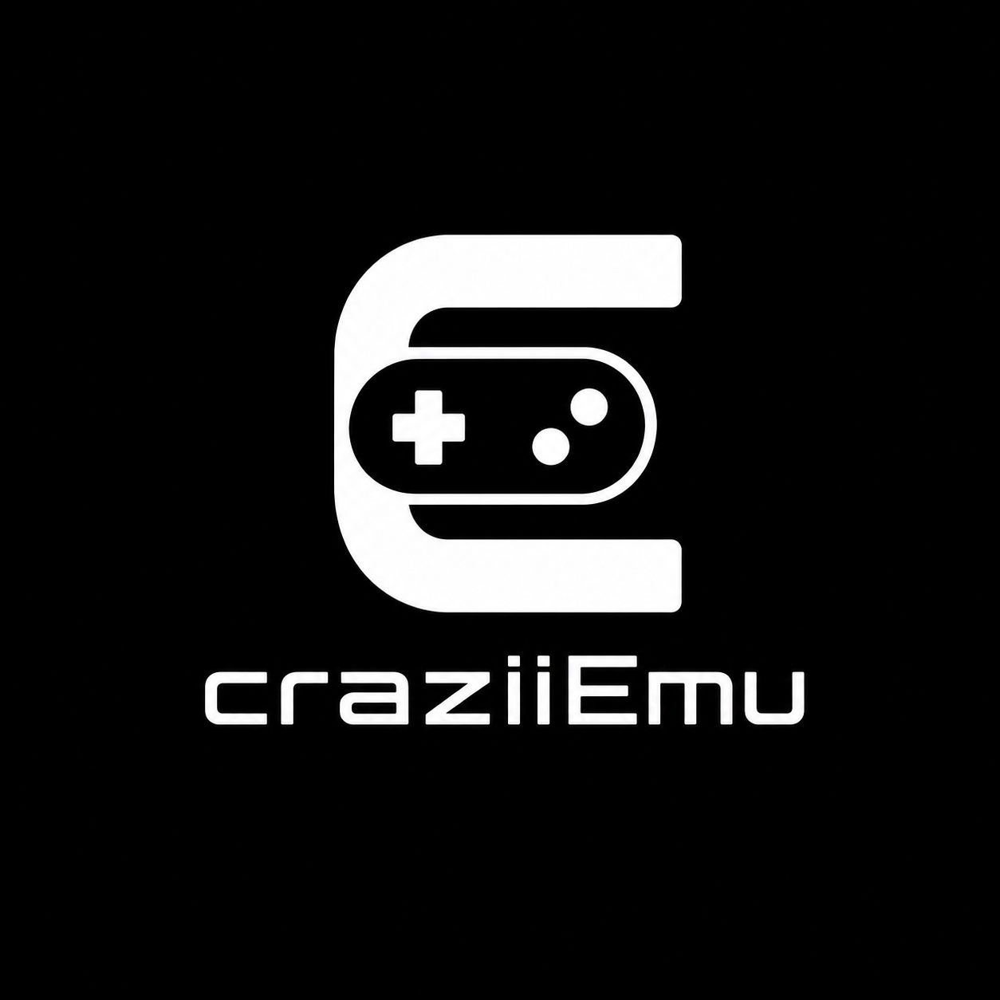
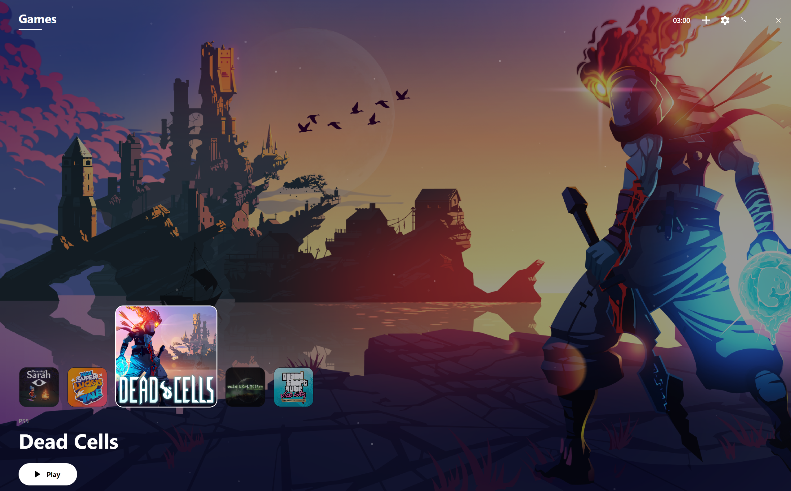
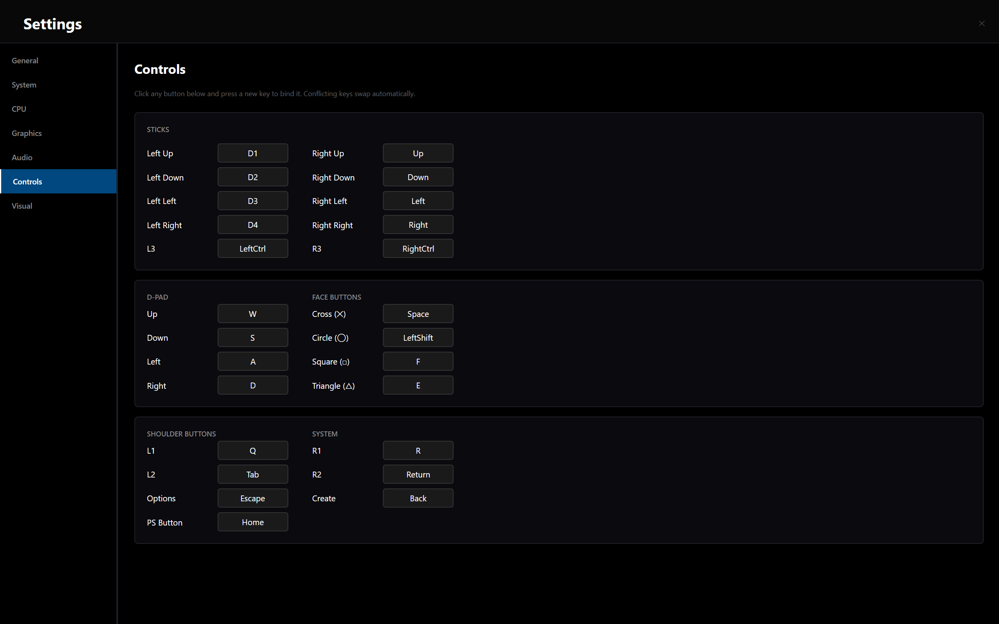

# Project craziiEmu

<p align="center">
  
</p>

<p align="center">
  <strong>An experimental, high-contrast PlayStation 5 research platform and compatibility layer.</strong>
</p>

---

> [!WARNING]  
> **ANTI-PIRACY & INTELLECTUAL PROPERTY DISCLAIMER**  
> *   **Project craziiEmu strictly condemns the use of software piracy, copyrighted hacks, and unauthorized game distribution.** 
> *   The use of pirated software, leaked keys, or copyrighted assets is strictly not entertained, supported, or tolerated by this project.
> *   This is an independent, non-profit research and educational project built on top of sharpemu, focused on studying microarchitecture and systems virtualization.
> *   This repository does **not** contain or distribute any copyrighted Sony system firmware, proprietary BIOS, cryptographic keys, or official PlayStation assets. Users must provide their own legally obtained, decrypted system files and game dumps extracted from hardware they physically own.

> [!WARNING]  
> **GRAPHICS API COMPATIBILITY STATUS**  
> *   **Vulkan:** Highly recommended and stable. It serves as the primary presentation target for graphics hardware rendering.
> *   **OpenGL:** Currently supported as a legacy presentation fallback, but is considered **unstable and may experience crashes** under heavy rendering workloads.

---

## Overview

**Project craziiEmu** is an experimental PlayStation 5 compatibility layer and virtual machine emulator built entirely in C# on modern .NET. 

This project is built directly on top of the excellent groundwork laid by the open-source **[sharpemu](https://github.com/par274/sharpemu)** emulator project. Our focus is on optimizing memory management bounds, standardizing high-level operating system system calls (HLE), and introducing a premium, console-like desktop experience for research testing.

Currently, development and compilation primarily target 64-bit Windows systems (refer original developer page).

---

## Key Features

### 🖥️ Premium Console-Like Desktop GUI (Avalonia UI)
Instead of a standard, cluttered desktop window, `craziiEmu` features a highly custom, minimalist, dark-themed console dashboard designed natively using **Avalonia UI**:
*   **Fluid Game Carousel:** A horizontally scrolling, responsive card system representing your executable library, modeled directly after modern console interfaces.
*   **Custom Brand Integration:** Displays the project's custom compiled identity and boot splash screen cleanly.
*   **On-Demand Ambient Particles:** Integrates an active, lightweight background rendering control that draws subtle, floating physics-based dust particles updating at 60 FPS.
*   **Dynamic Wallpaper & VRAM Blitting:** Automatically maps the game's native background artwork assets (`pic1.png`) dynamically to the dashboard when focused, rendering color sweeps with high contrast.
*   **Real-time Log Console:** A toggleable, built-in diagnostic terminal pane at the bottom of the dashboard that streams active CPU tracing, symbol relocation logs, and system alerts.
*   **Settings Configuration Dialog:** A dedicated, clean settings menu to configure directory paths, choose CPU accuracy modes (Accurate vs. Fast/Native), and select graphics devices.

### 🎮 Advanced Keyboard & Controller Mapping
*   **Dynamic Customization:** Allows users to interactively map any physical keyboard key directly to virtual PlayStation controller inputs.
*   **Duplicate-Swapping Conflict Resolution:** If you assign a key that is already mapped to another button, the system automatically swaps the two bindings in memory, preventing double-bind conflicts.
*   **Broad Controller Support:** Natively supports standard controller inputs (including DualShock 3, DualShock 4, DualSense, and Xbox controllers) mapped via local XInput polling.

### 🧠 Dual-Mode CPU Execution Engine
`craziiEmu` features a highly advanced, dual-mode execution pipeline. Users can toggle between accuracy and raw speed inside the System Configuration window:
*   **Accurate Mode (Software Interpreter):** An instruction-by-instruction decoder powered by the `Iced` library, useful for rigorous step-by-step debugging and absolute trace diagnostics. It decodes standard arithmetic, stack frames, relative jumps, and loop control instructions (`push`, `pop`, `cmp`, conditional jumps).
*   **Fast Mode (Direct/Native Execution):** Bypasses the software interpreter entirely and executes guest x86-64 code directly on the host CPU using the native `DirectExecutionBackend` at full hardware speed. This bypasses the instruction limit of the interpreter, allowing fully optimized compiler binaries to execute.

### 🧠 Core Virtualization & Emulation Engine
*   **Dual ELF & SELF Loading:** Seamlessly detects and parses standard 64-bit ELF binaries as well as Sony's custom, compressed `SELF` (`SCE\0`) container formats, extracting entry points natively.
*   **Dynamic Linker & Relocation Engine:** Parses `PT_DYNAMIC` program headers, recursively loads dependent `.sprx` system modules, and patches complex standard pointer relocations (`R_X86_64_RELATIVE`, `R_X86_64_GLOB_DAT`, `R_X86_64_JUMP_SLOT`).
*   **Unmanaged memory manager (VMM):** Allocates a massive 64GB contiguous address space pool. Features a pure **native x86-64 assembly page-fault VEH trampoline** to bypass strict .NET 10 hardware exception thread-boundary blocks.
*   **Page-Aligned Address Translation:** Implements a lightweight, TLB-style translation Page Table inside the memory manager to safely map sparse high-memory guest ranges (like the `0x700000000000` system call table) to safe physical RAM offsets.
*   **PS5 `libkernel` HLE Stubs:** Houses completed C# system-call implementations for core OS operations, including thread sleeping (`sceKernelUsleep`), system time (`sceKernelGettimeofday`), and memory allocation (`sceKernelAllocateDirectMemory`).

---

## Interface & Mapping Preview

<p align="center">
  <em>Main Dashboard (Games Library Tab)</em><br/>
  
</p>

<p align="center">
  <em>Advanced Key-Mapping Controller Configuration</em><br/>
  
</p>

---

## Build & Installation

To compile and run `craziiEmu` natively on your computer:

### Prerequisites
*   **.NET 10 SDK** (or newer)
*   A 64-bit Windows operating system (Windows 11 recommended)

### Compilation Steps
1.  Clone the repository:
    ```bash
    git clone https://github.com/yourusername/craziiEmu.git
    cd craziiEmu
    ```
2.  Build the solution:
    ```bash
    dotnet build -c Release
    ```
3.  Publish as a standalone, single-file native Windows executable:
    ```bash
    dotnet publish src/CraziiEmu.UI/CraziiEmu.UI.csproj -c Release -r win-x64 --self-contained true -p:PublishSingleFile=true -p:PublishTrimmed=false
    ```
4.  The final, standalone binary **`CraziiEmu.UI.exe`** will be located in the `artifacts/publish/` folder.

---

## Community Feedback

This is an early-stage experimental research project. Community feedback, detailed bug reports, and pull requests are highly appreciated. If you encounter missing instructions or unmapped system calls, please open an issue in the tracker with your absolute terminal log trace.

---

## Special Thanks

*   **[par274 / sharpemu](https://github.com/par274/sharpemu):** This project is built directly on top of `sharpemu`'s original source code. We are immensely grateful to the original creator for providing the brilliant architectural codebase and reverse-engineering research.
*   **[ShadPS4](https://github.com/shadps4-emu/shadPS4):** Extremely helpful for studying the PlayStation shared library and kernel behaviors.
*   **Ryujinx:** Provided outstanding design references for high-performance C# filesystem and unmanaged memory abstractions.

---

## License

This project is licensed under the terms of the **GNU General Public License v2.0 (GPL-2.0)**.
See the [LICENSE](https://github.com/craze1pirate/craziiEmu/blob/main/LICENSE) file for details.