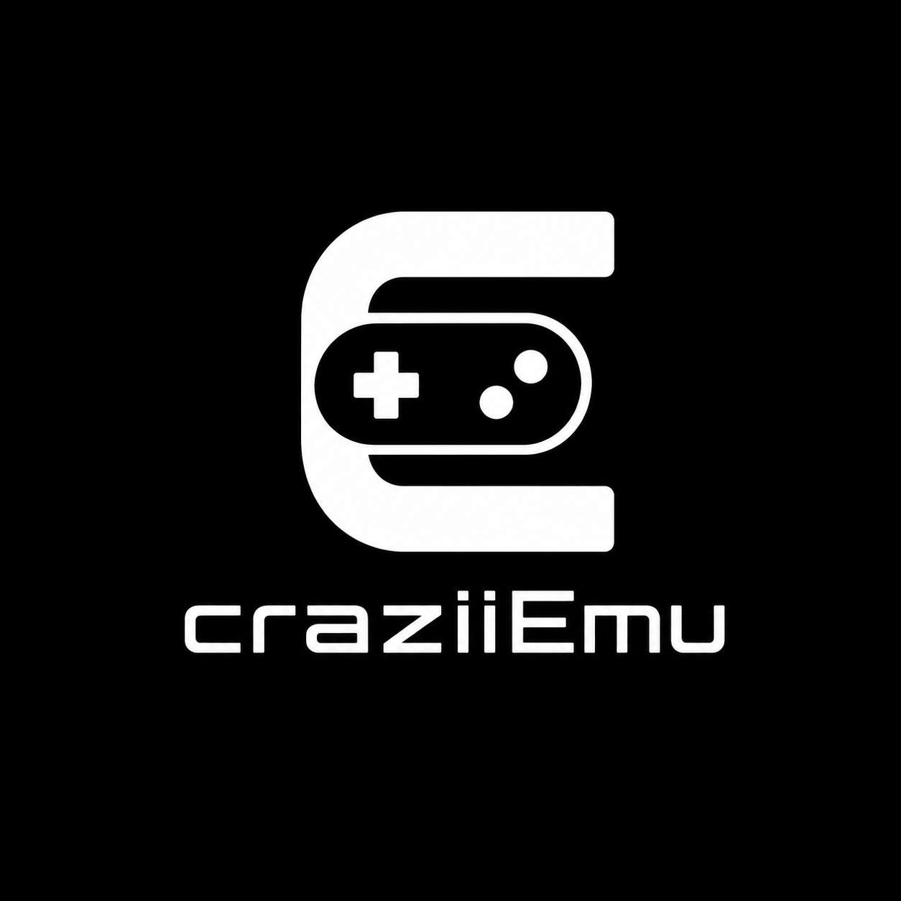
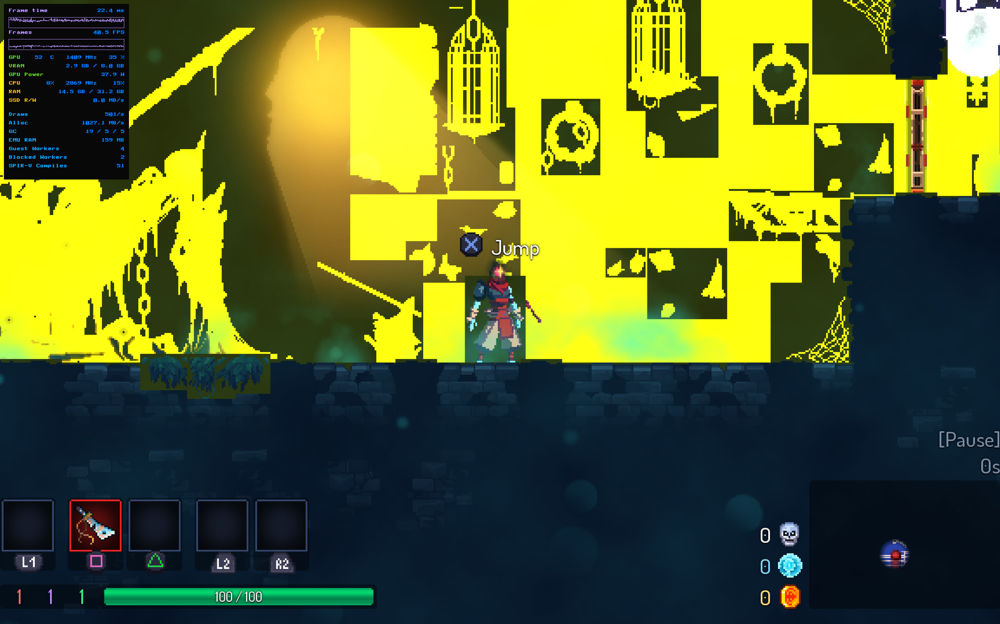
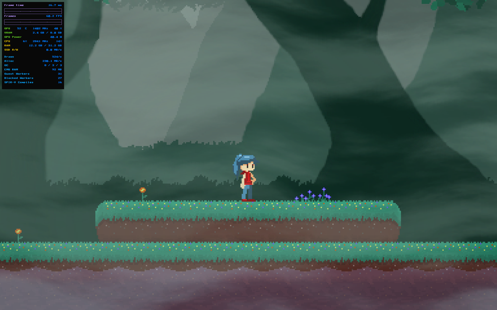
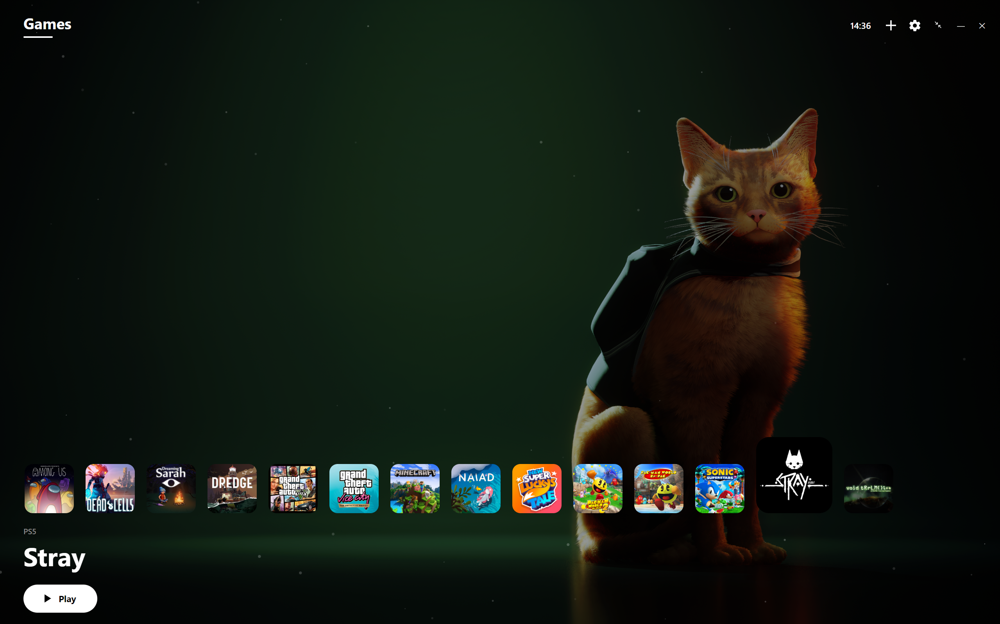
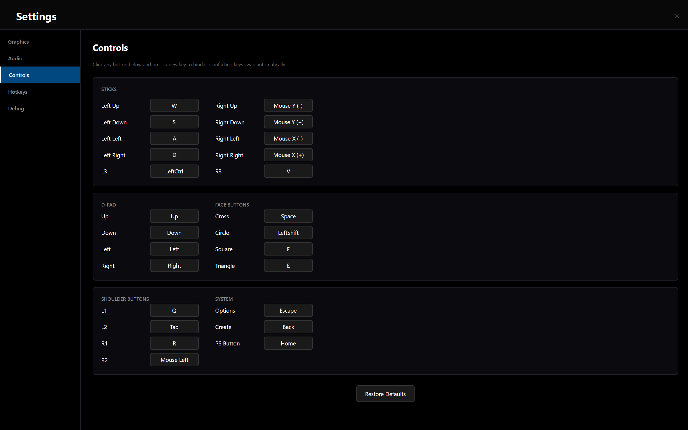

<div align="center">
  
  <h1>craziiEmu</h1>
  <p><strong>An experimental, Windows-only PlayStation 5 compatibility layer and emulator built with C# and .NET 10.</strong></p>

  [-0078D4?style=flat&logo=windows)](https://github.com/craze1pirate/craziiEmu)
  [](https://dotnet.microsoft.com/)
  [](https://www.vulkan.org/)
  [](https://github.com/craze1pirate/craziiEmu/releases)
  [](LICENSE)
</div>

---

> [!WARNING]  
> ### 🔬 Educational & Research Purpose
> craziiEmu is developed for **purely educational and research purposes** to explore low-level systems programming, operating system internals, x86-64 execution environments, and Vulkan GPU rendering pipelines. Emulation is highly experimental, many PlayStation 5 kernel services and GPU features are actively being developed, and instability or missing functionality is expected.

> [!IMPORTANT]  
> ### ⚖️ Legal Disclaimer
> craziiEmu does **not** distribute or include:
> * PlayStation 5 system software, BIOS, or proprietary Sony libraries
> * Cryptographic keys, game dumps, or copyrighted assets
> 
> Users must legally own and dump their own hardware and games. **This project strictly condemns and does not endorse piracy.**

---

## Overview

**craziiEmu** is an experimental, open-source, **Windows-only** PlayStation 5 compatibility layer and emulator targeting **Windows x64**. Built on modern **.NET 10** and written in C#, the project combines high-performance direct x86-64 host execution with low-level Vulkan hardware acceleration and a sleek, console-inspired Avalonia UI frontend.

> **Note:** craziiEmu is strictly developed for **Windows 10 and Windows 11 (64-bit)**. There is no support for Linux or macOS.

While initially inspired by and incorporating core foundations from the open-source **[SharpEmu](https://github.com/par274/sharpemu)** project, craziiEmu has rapidly progressed beyond a frontend into active, independent systems engineering—introducing significant enhancements across GFX10 GPU texture detiling, multi-render target (MRT) parity, kernel synchronization fast-paths, hardware watchdog diagnostics, and dynamic resolution scaling.

---

## Compatibility Showcase

craziiEmu is actively progressing commercial game boot sequences and in-game execution:

### *Dead Cells* (PPSA15552) — **In-Game**
*Dead Cells* boots seamlessly into 2D gameplay with responsive combat, full controller input, and playable 30-40 FPS performance.

<div align="center">
  
  <p><em>Dead Cells running in-game on craziiEmu (30-40 FPS, Vulkan backend)</em></p>
</div>

*Current Status:* In-game at 30-40 FPS (minor visual passes remaining).

---

### *Dreaming Sarah* — **Playable**
*Dreaming Sarah* runs with full 2D graphics rendering, responsive player controls, and stable performance.

<div align="center">
  
  <p><em>Dreaming Sarah running playable on craziiEmu (Vulkan backend)</em></p>
</div>

*Current Status:* Fully playable.

---

### *Among Us* — **Intro / Logo (Not Playable Yet)**
*Among Us* initializes through early boot sequences, mounts game files, and successfully presents developer and title intro logos via Vulkan swapchain presentation.

*Current Status:* **Boots only until logo.** The game stops prior to reaching title menus or online/local lobbies due to pending networking and runtime stubs. It is **not playable yet**, with active research underway to advance its execution state.

---

### *Stray* (PPSA02100) — **Intro / Logo**
*Stray* executes through Unreal Engine 4's custom memory allocator (`FMallocBinned2`), initializes native spinlocks, and renders early splash sequences.

---

### Compatibility Tier Classification

| Tier | Meaning | Representative Titles |
| :--- | :--- | :--- |
| **Playable** | Boots, reaches gameplay, and can be played with stable performance and sound. | *Dreaming Sarah*, *void tRrLM(); //Void Terrarium* |
| **In-Game** | Reaches gameplay loop, but performance issues or game-breaking glitches may occur. | *Dead Cells* (minor visual passes remaining) |
| **Intro / Logo** | Boots past bootloader, initializes runtime services, and renders intro/title logos. | *Stray*, *Among Us*, *Naiad*, *Grand Theft Auto V* |
| **Loads** | Parses ELF/SELF headers, loads modules, but crashes before rendering visual frames. | *Sonic Superstars* |

---

## Engineering & Architecture

craziiEmu integrates several specialized low-level subsystems:

### 1. Vulkan & AGC Graphics Pipeline
* **GFX10 Texture Swizzling & Detiling:** Native implementations of PS5 GFX10 micro-tile swizzle modes (modes 21, 25, 8, 20) with precise pitch and slice calculation to eliminate texture corruption.
* **1:1 MRT Parity & Hardware ROP Masks:** Full alignment of Vulkan color attachment indices with guest shader export slots, honoring PS5 hardware write masks (`colorWriteMask = 0`).
* **Dynamic Resolution Scaling:** Multi-tier viewport scaling supporting:
  * **Ultra & High:** 4K (3840×2160), 2K (2560×1440), and Native 1080p.
  * **Low-Spec Scaling:** 720p, **480p**, and **360p** modes for resource-constrained GPUs.
* **HDR10 Color Pipeline:** Integrated HDR toggle (**Disable**, **Enable**, **Auto**) providing SMPTE ST 2084 (PQ) to scRGB linear color transform passes.
* **RenderDoc Integration:** One-touch frame capture triggered directly from inside the emulator via the `F10` key.

### 2. Kernel & Thread Synchronization
* **Direct Host Execution:** Guest x86-64 code executes directly on the Windows host CPU without interpretive virtualization overhead.
* **Atomic `sceKernelSyncOnAddress`:** Wait32 and Wait64 futex fast-paths with atomic thread awakening, eliminating lockup stalls in multi-threaded game loops.
* **TLS & Thread Control Block (TCB):** Full guest Thread Local Storage layout mapping matching PS5 userland ABI conventions.
* **VEH Exception Trampoline:** Intercepts unmapped page accesses and hardware signals on Windows to safeguard guest execution state.

### 3. Hardware Diagnostics & Watchdog
* **Live Register Capture:** When a guest thread stalls or encounters an unhandled fault, the watchdog snapshots the full CPU context (`RIP`, `RSP`, `RAX`, `RBX`, `RCX`, `RDX`, `RSI`, `RDI`, `R8`–`R15`, and RFLAGS) via Win32 `GetThreadContext`.
* **Disassembly Diagnostics:** Uses `IcedDecoder` to disassemble x86-64 machine code directly at `RIP`, pinpointing missing syscalls or illegal memory offsets.
* **Telemetry Overlay (`F3`):** Direct-rasterized HUD reporting framerate, frametimes, host memory usage, and swapchain health.
* **Standalone Log Terminal (`F4`):** Real-time diagnostic window decoupled from the main render thread for trace debugging.

### 4. Audio & Media Decoders
* **Lockless 48kHz Audio Engine:** Low-latency circular event pacing to prevent crackle or buffer underruns.
* **Hardware Video Decoders:** FFmpeg-powered decoding for `videodec2`, `avplayer`, and Bink2 container streams.
* **Hardware PNG Decoder:** Native `libScePngDec` decompression for fast UI asset loading.

---

## Modern Dashboard Interface

craziiEmu includes a custom, console-grade user interface built using **Avalonia UI**:

<div align="center">
  <p><em>Console-Style Horizontal Library Dashboard</em></p>
  

  <br><br>

  <p><em>Advanced Interactive Controller Configuration & Mapping</em></p>
  
</div>

* **Dynamic Artwork Extraction:** Automatically pulls high-resolution game icons and background artwork from game packages.
* **Conflict-Free Input Remapping:** Intuitive controller setup with automatic key-swapping to eliminate duplicate input bindings.
* **Dedicated Fullscreen:** True edge-to-edge fullscreen presentation toggled dynamically via `F11`.

---

## System Hotkeys
| Key | Function |
| :--- | :--- |
| `F3` | Toggle On-Screen Telemetry HUD (FPS, frametimes, RAM) |
| `F4` | Open Standalone Real-Time Diagnostic Log Window |
| `F10` | Trigger In-App RenderDoc Frame Capture |
| `F11` | Toggle Fullscreen Mode |

---

## Build & Installation

### Prerequisites
* **Operating System:** **Windows 10 / 11 (64-bit) exclusively** (Linux and macOS are not supported)
* **[.NET 10 SDK](https://dotnet.microsoft.com/download/dotnet/10.0)** (or later)
* A **Vulkan 1.3** compatible GPU (NVIDIA GeForce GTX 10-series / AMD Radeon RX 5000-series or newer recommended)

### Building from Source
```bash
# 1. Clone the repository
git clone https://github.com/craze1pirate/craziiEmu.git
cd craziiEmu

# 2. Build the solution in Release mode
dotnet build -c Release

# 3. Launch craziiEmu
dotnet run --project src/craziiEmu.UI
```

### Standalone Executable Packaging
To create a clean, single-file release package without separate runtime dependencies:
```bash
dotnet publish src/craziiEmu.UI/craziiEmu.UI.csproj -c Release -r win-x64 --self-contained true -p:PublishSingleFile=true
```

---

## Acknowledgements & Upstream Projects

craziiEmu stands on the shoulders of giants in the open-source emulation and reverse-engineering community:
* **[SharpEmu](https://github.com/par274/sharpemu)** — The foundational C# PS5 emulation project providing the initial architecture, ELF loading, and direct execution design.
* **[KytyPS5](https://github.com/KytyPS5/KytyPS5)** — Invaluable reference for NID implementations, kernel structures, and game boot flow analysis.
* **[shadPS4](https://github.com/shadps4-emu/shadPS4)** — Benchmark reference for modern PlayStation architecture, kernel emulation, and graphics translation.

---

## License

craziiEmu is licensed under the **GNU General Public License v2.0 (GPL-2.0)**. See the [LICENSE](LICENSE) file for complete details.
